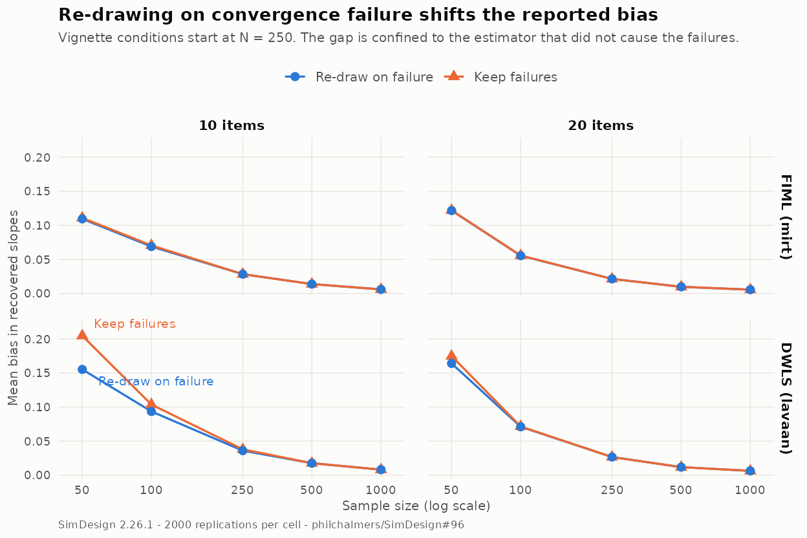

# Does re-drawing on convergence failure change a simulation's results?

Supporting study for [philchalmers/SimDesign#96](https://github.com/philchalmers/SimDesign/issues/96).

The `MultipleAnalyses` vignette notes that applying analysis functions to
different generated datasets is "theoretically unbiased" but "could have
ramifications should the analysis functions throw errors at different rates".
This study measures those ramifications in the vignette's own simulation. The
short answer: at the vignette's published sample sizes the effect is small to
absent, and below them it is large, one-sided, and easy to mistake for a
property of the estimator.

## Setup

The vignette's parameter-recovery example, unchanged: a unidimensional
normal-ogive IRT model with binary items, recovered two ways.

* **FIML** — marginal maximum likelihood via `mirt`, convergence checked with
  `extract.mirt(mod, 'converged')`
* **DWLS** — ordinal one-factor CFA via `lavaan`, convergence checked with
  `lavInspect(lmod, 'converged')` and admissibility with
  `lavTech(lmod, 'post.check')`

Both target the same quantity, the item slopes `a`. The design grid is the
vignette's (`sample_size` 250/500/1000, `nitems` 10/20) extended downwards to
50 and 100, with 2000 replications per cell.

`02-run-study.R` runs the simulation once with the re-draw switched **off**
(failures return `NA`, `control = list(allow_na = TRUE)`), storing every
replication together with per-estimator convergence and admissibility flags.
`03-analyse.R` then applies three policies to those same draws:

| policy | meaning |
| --- | --- |
| `none` | use every replication that produced finite estimates |
| `marginal` | drop only the replications where *this* estimator failed — no re-draw |
| `listwise` | drop the replication if *either* estimator failed — what re-drawing produces |

Evaluating all three on one set of draws makes the comparison paired: a
difference between policies cannot be run-to-run Monte Carlo noise.
`04-redraw-run.R` then performs the re-draw for real, using the vignette's
`stop()`-based analysis functions, to confirm `listwise` is what re-drawing
actually yields.

### Two preliminary findings, before any policy comparison

**`lavInspect(lmod, 'converged')` never fires.** lavaan converged on 100% of
replications in every cell, including N = 50. The vignette's only lavaan guard
is dead code. Inadmissible solutions were nonetheless being excluded, because
`sqrt(1 - alpha^2)` returns `NaN` for a Heywood loading and SimDesign re-draws
on `NaN` by default. So the vignette already re-draws on inadmissibility — via
a side effect, for a reason it never records. `lavTech(., 'post.check')`
detects 8.4% inadmissible solutions at N = 50 / 10 items, dropping to 0% by
N = 500.

**`F ~~ 1*F` fixes the factor's variance but not its orientation.** At N = 50,
15.3% of lavaan solutions are sign-reflected, and lavaan reports them as
converged *and* `post.check`-clean, because they are legitimate solutions of
the model as written. This is an identification artifact, unrelated to the
re-draw question, but left alone it dwarfs everything else (DWLS RMSE on the
loading scale looks like 0.52 rather than 0.15). `03-analyse.R` resolves it
explicitly before any comparison; the analysis functions in `00-common.R` stay
faithful to the vignette's code.

## Result 1: who actually gets discarded

`mirt` is the weaker link at small N, so the re-draw discards `lavaan` fits.

| N | items | FIML fails | DWLS fails | DWLS fits discarded because FIML failed |
| ---: | ---: | ---: | ---: | ---: |
| 50 | 10 | 26.1% | 8.4% | **20.3%** |
| 100 | 10 | 5.4% | 2.4% | 3.5% |
| 250 | 10 | 0.8% | 0.05% | 0.7% |
| 500 | 10 | 0.05% | 0.0% | 0.05% |
| 1000 | 10 | 0.0% | 0.0% | 0.0% |
| 50 | 20 | 7.7% | 1.8% | 6.3% |
| 100 | 20 | 0.2% | 0.1% | 0.2% |
| 250+ | 20 | 0.0% | 0.0% | 0.0% |

At N = 50 with 10 items, one in five of lavaan's admissible solutions is thrown
away for a reason that has nothing to do with lavaan. The reported DWLS
performance is conditioned on `mirt` converging.

This asymmetry is the general point: **the estimator with the better
convergence behaviour is the one whose results the re-draw distorts**, because
it is the one inheriting a competitor's failures. FIML lost only 1.2% of its
own usable fits to DWLS at the same condition.

## Result 2: the reported bias changes



On the slope scale the vignette actually tabulates, averaged over items
(bootstrap SE over 1000 resamples of the replications):

| N | items | est. | bias, re-draw | bias, no re-draw | difference | z |
| ---: | ---: | --- | ---: | ---: | ---: | ---: |
| 50 | 10 | DWLS | 0.1552 | 0.2046 | **+0.0493** | 9.7 |
| 50 | 10 | FIML | 0.1094 | 0.1109 | +0.0015 | 2.3 |
| 100 | 10 | DWLS | 0.0936 | 0.1037 | +0.0101 | 4.8 |
| 100 | 10 | FIML | 0.0689 | 0.0706 | +0.0017 | 1.7 |
| 250 | 10 | DWLS | 0.0361 | 0.0380 | +0.0019 | 2.7 |
| 500 | 10 | DWLS | 0.01764 | 0.01772 | +0.0001 | 1.0 |
| 1000 | 10 | DWLS | — | — | 0.0000 | — |
| 50 | 20 | DWLS | 0.1640 | 0.1747 | +0.0107 | 4.9 |
| 100 | 20 | DWLS | 0.0711 | 0.0715 | +0.0005 | 2.0 |
| 250+ | 20 | DWLS | — | — | 0.0000 | — |

**At N = 50 with 10 items, re-drawing understates DWLS's bias by 24% and its
RMSE by 21%** (0.611 vs 0.770). The bias understatement is roughly the size of
the bias values the vignette reports for individual items, so it is not a
rounding-level concern on that scale.

The effect decays fast. It is unambiguous at N = 50 and N = 100, still
detectable at N = 250 (the vignette's smallest condition, z = 2.7, but only 5%
of the reported bias), and exactly zero at N = 500 and N = 1000 where neither
estimator ever fails. This matches the mechanism: no failures, no selection, no
effect.

On the bounded loading scale `lambda = a / sqrt(1 + a^2)` — a monotone
reparameterisation of the identical estimand — the differences are much
smaller (|z| < 2.6 throughout). The gap between the two scales says the
selection effect lives mostly in the tail: re-drawing preferentially removes
replications with extreme slopes, which the unbounded `a` metric weights
heavily and the bounded one does not. Since the vignette reports the `a`
metric, the `a`-scale numbers are the relevant ones for its conclusions.

## Result 3: what does not change

The estimator *ranking* is stable. DWLS has the lower RMSE on the loading scale
in every cell under all three policies, and no policy flips a winner anywhere
in the design. A reader who only wanted to know "which estimator recovers the
slopes better" would reach the same verdict either way.

So the honest summary is narrower than "re-drawing invalidates the study": the
re-draw does not change *this* study's qualitative conclusion, but it does
change the numbers that study publishes, by up to a quarter of their value, in
a direction that always flatters whichever estimator is not causing the
failures.

## Result 4: the failure rates themselves

The re-draw's largest cost is not the perturbation to bias — it is that the
convergence and admissibility rates never reach the results object at all. In
this design those rates are:

* `mirt` fails on 26% of N = 50 / 10-item datasets; `lavaan` on 8%
* `lavaan` converges 100% of the time everywhere, so its failures are entirely
  admissibility failures, invisible to a convergence check

Under the re-draw, all of that collapses into a pooled `ERRORS` count that
cannot be attributed to a particular analysis function. For an
estimator-comparison study, "how often does each method produce a usable
answer" is usually a headline result rather than a nuisance, and re-drawing
deletes it.

## Reproducing

```
cd dev/issue96
Rscript 01-pilot.R        # failure rates and timings on a small grid
Rscript 02-run-study.R    # main run, no re-draw, ~50 min on 4 cores
Rscript 03-analyse.R      # policy comparison, writes the .csv files
Rscript 04-redraw-run.R   # the same simulation with the re-draw switched on
Rscript 05-compare-redraw.R
Rscript 06-figure.R      # redraw-effect.png
```

Derived tables are committed as `.csv`; the raw `.rds` output is regenerable
and is not tracked.

Session: R 4.3.3, SimDesign 2.26.1, mirt 1.46.1, lavaan 0.6-17.
